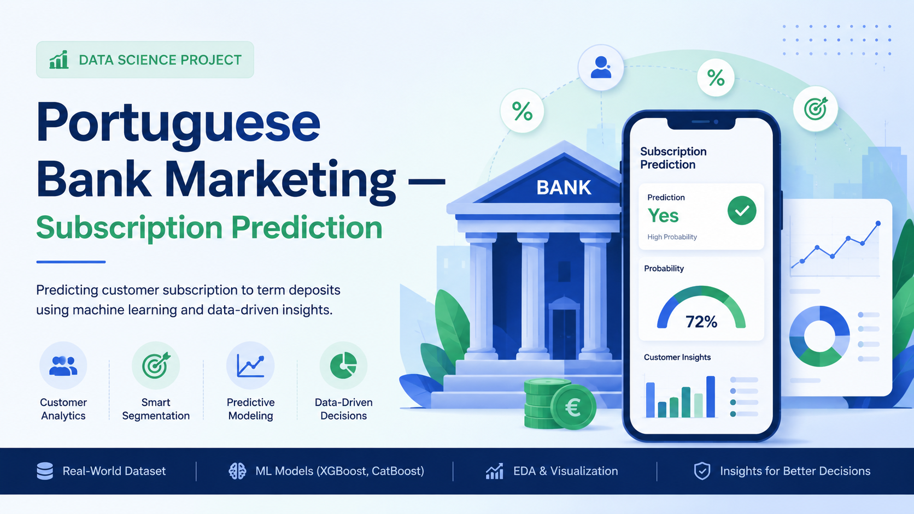

#  Portuguese Bank Marketing — Subscription Prediction

> An end-to-end ML project predicting customer subscription to term deposits for a Portuguese banking institution, with an interactive Streamlit dashboard featuring per-customer SHAP explanations.

---

##  Key Results

| Metric | Value | Context |
|---|---|---|
| **Test ROC-AUC** | **0.8140** | Matches the published research benchmark for this dataset |
| **Test PR-AUC** | 0.4878 | 4.3× the baseline of 0.113 |
| **F1 Score** | 0.5328 | At F1-optimized threshold of 0.66 |
| **Top-20% Lead Capture** | **66.4%** | Calling the top 20% by score captures two-thirds of subscribers |
| **Top-decile Lift** | 4.7× | Top 10% by score convert at 4.7× the population rate |

---

##  Live Demo

🔗 **[Try the dashboard](https://YOUR-STREAMLIT-URL.streamlit.app)** _(add link after deployment)_

---

##  Dashboard Tabs

| Tab | What It Does |
|---|---|
|  **Campaign Overview** | Interactive analytics with filters by demographic, channel, and timing |
|  **Predict Customer** | Enter a customer profile → get probability + call/skip recommendation |
|  **Why This Prediction?** | Per-customer SHAP waterfall — compliance-ready explanations |
|  **Model Insights** | Global SHAP, lift chart, interactive threshold slider with business impact |
|  **Recommendations** | 14 data-backed action items for the marketing team |

---

##  Methodology

**Data:** UCI Bank Marketing dataset (41,188 contact records, 20 features, May 2008 – Nov 2010)

**Pipeline:**
1. **EDA** — 13 charts identifying actionable patterns (golden months, segment fairness, diminishing returns)
2. **Cleaning** — Dropped duplicates, engineered `was_contacted_before` flag, removed leaky `duration` feature
3. **Modeling** — Compared 5 models (Logistic, RF, GBM, XGBoost, LightGBM) with stratified 5-fold CV
4. **Tuning** — 100 Optuna trials on LightGBM with Bayesian optimization
5. **Ensemble** — Soft-voting of LightGBM + XGBoost + CatBoost; data-driven selector picked tuned LightGBM as final
6. **Explainability** — SHAP TreeExplainer for global feature importance + per-customer waterfall
7. **Evaluation** — Threshold tuning, confusion matrix, ROC/PR curves, lift chart, calibration, per-segment AUC

---

## 🧠 Key Insights for the Marketing Team

- **Call the top 20% of customers by model score** — captures **66.4%** of all subscribers
- **Reallocate from May to golden months (Mar/Sep/Oct/Dec)** — currently 20–80× fewer contacts despite 5–10× higher conversion
- **Cellular contacts convert at 14.7%** vs telephone at 5.2% — channel choice is the #3 most important feature
- **Cap contact attempts at 3–4 per campaign** — conversion drops below average after the 3rd attempt
- **Trigger campaigns on Euribor rate drops** — customers seek capital safety during low-rate periods

---

##  Tech Stack

- **Python 3.11** · **scikit-learn** · **LightGBM** · **XGBoost** · **CatBoost** · **Optuna**
- **SHAP** for explainability
- **Streamlit** for the interactive dashboard
- **Plotly** + **Matplotlib** for visualizations
- **pandas** · **NumPy** · **joblib**

---

##  Project Structure